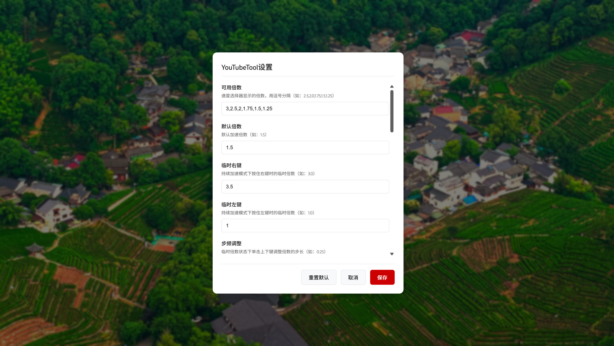
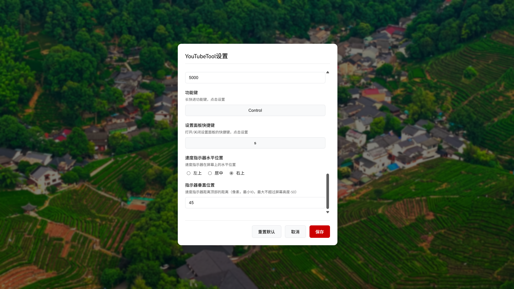

YouTubeTool 播放控制增强脚本

⚠️ 重要说明：本人不懂技术，此脚本完全通过AI辅助编写，可能存在未知问题。希望有懂技术的朋友能够对脚本进行改良、优化和加强。

📖 项目简介

这是一个用于 YouTube 的用户脚本，提供增强的视频播放控制功能，包括倍速控制和快速跳转功能。脚本通过键盘快捷键操作，让视频观看体验更加流畅高效。

🚀 主要功能

一、倍速控制功能

	1. 基础加速模式
		长按右键：临时加速到默认倍速（默认1.5倍）

		松开右键：自动恢复原速

	2. 持续加速模式
		自动进入：长按右键5秒自动切换（时长可设置）

		快速进入：按住右键时单击左键立即进入

		双击切换：双击右键立即进入/退出持续加速模式

		特性：持续模式下松开右键仍保持加速状态

	3. 倍速调节
		快捷调节：持续加速模式下，单击↑↓键按预设列表调整倍速

		预设列表：可自定义配置多个常用倍速选项

	4. 临时倍速模式
		右键临时倍速：持续加速模式下再次长按右键进入（默认3.0倍）

		左键临时倍速：持续加速模式下长按左键进入（默认1.0倍）

		快捷调节：临时倍速模式下，单击↑↓键按步频调整倍速（默认±0.25）

二、快速跳转功能

	1. 基础跳转
		单击右键：快进5秒（可设置）

		单击左键：快退5秒（可设置）

	2. 长跳转模式
		功能键组合：
			按住功能键（默认Shift）时：
				单击右键：快进10秒（可设置）
				单击左键：快退10秒（可设置）

		锁定模式：双击功能键锁定长跳转，再次双击退出

🤝 寻求技术帮助

由于本人技术能力有限，此脚本可能存在以下问题：

	可能存在性能和内存管理问题

	状态管理可能不够健壮

	异常情况的处理不够完善

	在不同浏览器上的兼容性测试

	操作逻辑和界面交互的优化

	事件监听器的清理可能不完整

	与YouTube页面更新的兼容性

⚠️再次声明：本人非技术人员，此脚本通过AI辅助完成，可能存在各种技术问题。真诚欢迎懂技术的朋友对代码进行审查、优化和完善！

享受更流畅的 YouTube 观看体验！

